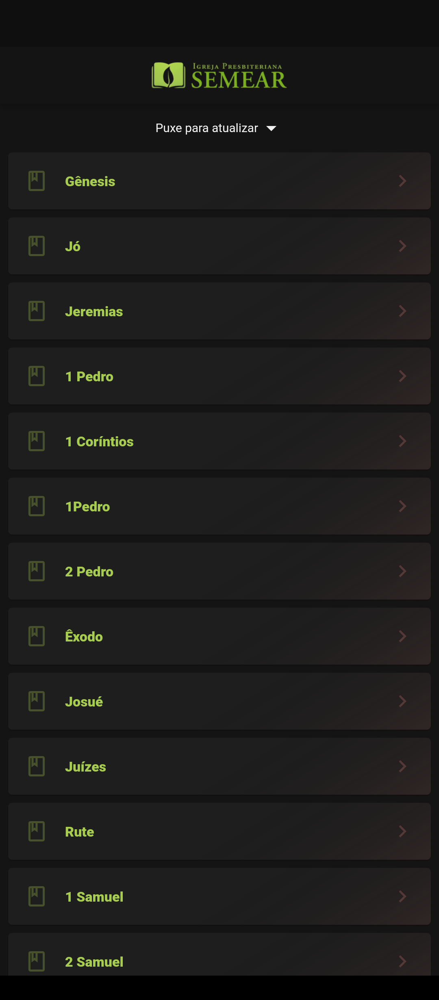
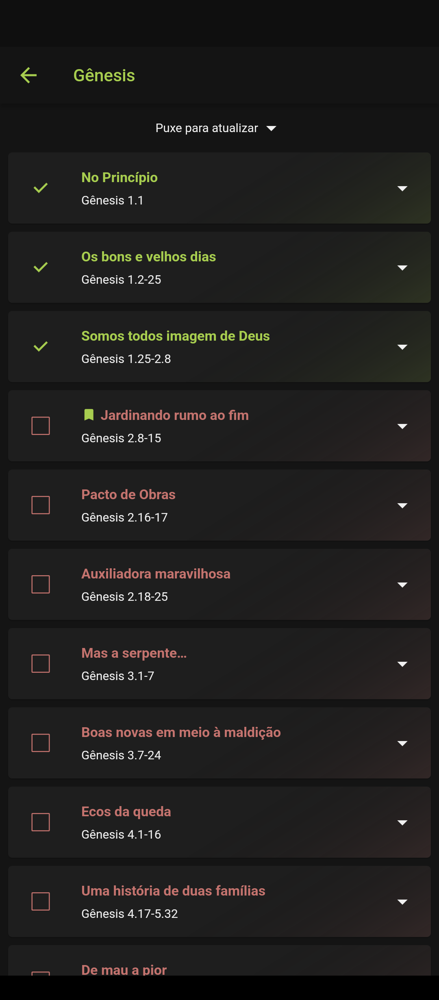

# IP Semear Sermões

Uma aplicação desenvolvida em [Flutter](https://flutter.dev) com o intuito de ouvir sermões presentes no site da [IP Semear](https://ipsemear.org/sermoes-audio/) de forma simples e prática, a organização de livros e capítulos de cada sermão é idêntica ao website.

Também conta com reprodução em segundo plano e controle de pausa e parada na barra de tarefas do Android.

# Download

[Clique aqui](https://github.com/FernandoAntonio/ip_semear_sermoes/releases/download/1.1.0/ip_semear.apk) para fazer o download do APK diretamente do GitHub.

# Screenshots

   

# Roadmap

1.  ☑ Revamp the UI
2.  ☑ Store books in Drift Database
3.  ☑ Pull to refresh data and save into Database
4.  ☑ Add dependency injection
5.  ☑ Store sermons in Drift Database
6.  ☑ Add animated lists
7.  ☑ Add audio visualizer
8.  ☐ Download sermons mp3
9.  ☐ Save progress
10. ☐ Store user preferences (e.g. replay or forward 5, 10 or 30 seconds)