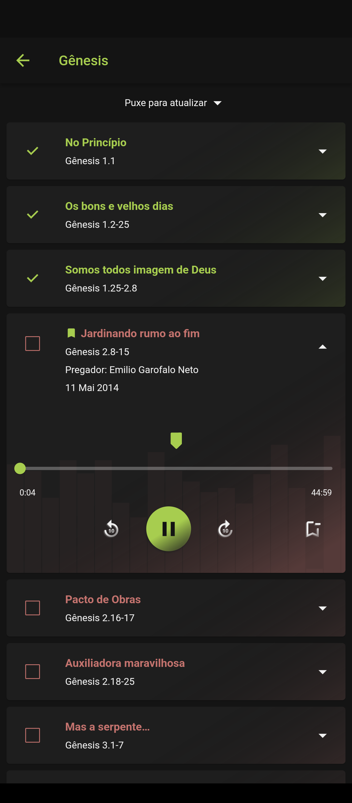

# IP Semear Sermões

Uma aplicação desenvolvida em [Flutter](https://flutter.dev) com o intuito de ouvir sermões presentes no site da [IP Semear](https://ipsemear.org/sermoes-audio/) de forma simples e prática, a organização de livros e capítulos de cada sermão é idêntica ao website.

Também conta com reprodução em segundo plano e controle de pausa e parada na barra de tarefas do Android.

# Download

[Clique aqui](https://github.com/FernandoAntonio/ip_semear_sermoes/releases/download/1.1.0/ip_semear.apk) para fazer o download do APK diretamente do GitHub.

# Screenshots

   

# Roadmap

1.  ☑ Atualizar a interface
2.  ☑ Armazenar livros no Banco de Dados Drift
3.  ☑ Adicionar "Puxe para atualizar" para atualizar dados no banco de dados
4.  ☑ Adicionar injeção de dependências
5.  ☑ Armazenar sermões no Banco de Dados Drift
6.  ☑ Adicionar lista animada
7.  ☑ Adicionar visualizador de áudio
8.  ☐ Baixar .mp3 dos sermões
9.  ☑ Salvar o progresso do usuário
10. ☐ Armazenar preferências do usuário (e.g. voltar ou avançar 5 segundos, 10 segundos , 30 segundos ou tempo personalizável)